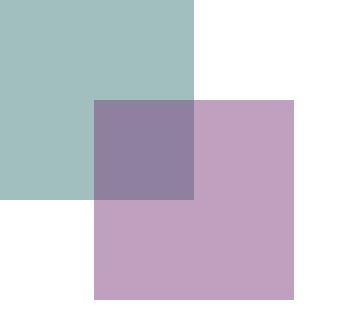

# jQuery CSS Pointer-Events Polyfill


[]()
[]()

This piece of javascript is a tiny Polyfill which adds support for the css-property `pointer-events: none|all;` for browsers not supporting it.

The size of the minified script is ~1000 bytes (roughly 500 bytes gzipped).

*[`pointer-events` browser support](http://caniuse.com/#feat=pointer-events)*

## Dependencies

This Polyfill depends on jQuery `@ ~1.9`.


## Usage

Include `jquery.pointer-events-polyfill.js` in your document, and call the polyfill like this:

```javascript
$(function(){
    window.pointerEventsPolyfill();
});
```

Now your page supports `pointer-events`!

If you want to remove the polyfill again, sometime later, use it like this:

```javascript
$(function(){
    var polyfill = window.pointerEventsPolyfill();
    // ...stuff
    polyfill.destroy();
});
```


## Caveats

### The polyfill doesn't catch events

Imagine you have two elements overlapping like this:



You want the purple element to not be clickable, so you add `pointer-events:none` to it.

Now you add click-listeners to both elements. When the intersecting area gets clicked, the first event to be thrown will be that of the purple element, the second one will be the green-ish one.

**The purple element's event will be thrown!**

### Synchronous callbacks might hide events temporarily

The Polyfill hides the elements synchronous to check whether the underlying elements have been clicked,
so you're better of not blocking the event-loop, when listening on the subscribed events in order to not have invisible elements.

Example:

```html
<div style="pointer-events: none;" class="non-clickable">
    <div style="pointer-events: all;" class="clickable"></div>
</div>

<script>
    window.pointerEventsPolyfill();

    $('.clickable').click(function(){
        // bad - alert blocks the event-loop, so .non-clickable
        // will be invisible while the alert is open
        alert('clicked');

        // better
        setTimeout(function(){
            alert('clicked');
        });
    });
</script>
```


## Available Options

You can call `window.pointerEventsPolyfill` with a couple of possibly useful options, namely:

* `selector` (jQuery-selector, default: `'*'`) - indicates which elements the polyfill should apply to.
* `listenOn` (Array, default: `['click', 'dblclick', 'mousedown', 'mouseup']`) - the events this plugin listens to. Excludes mouseover-events for performance, but you can add them yourself.
* `forcePolyfill` (Bool, default: `false`) - disregard the browsers support of `pointer-events` and force the polyfill to be added.
* `pointerEventsNoneClass` (String|null, default: `null`) - when truthy, add the polyfill to elements with this class, even when the elements css doesn't have the `pointer-events`-property set.
* `pointerEventsAllClass` (String|null, default: `null`) - when truthy, this element acts as `pointer-events: all;`-element. (The opposite of `pointerEventsNoneClass`).
* `eventNamespace` (String|null, default: `pointer-events-polyfill`) - the namespace this plugin should use to identify events.


## Changelog

* 0.2.4 - correct namespaces for subscriptions
* 0.2.3 - better test, remove explicit support for `pointer-events:auto`
* 0.2.2 - add namespace to the subscribed events, add first basic tests
* 0.2.1 - documentation
* 0.2.0 - change css-detection to use recursive traversion, detecting `pointer-events: none|all` on parent-elements
* 0.1.0 - initial version


## License

[MIT](LICENSE.md)


## Credits

Credits, where credits are due. This Polyfill is loosely based on @kmeworth's [pointer_events_polyfill](https://github.com/kmewhort/pointer_events_polyfill).

The reason for this package's existance is that the `pointer_events_polyfill` is seemingly unmaintained and no longer adheres to common jQuery-Plugin best practices. Also, this package is available on Bower & NPM.

**List of Contributors:**
* @kmeworth
* @mhmxs
* @raldred
* [Modernizr](https://github.com/Modernizr/Modernizr)
* and probably some more awesome people
